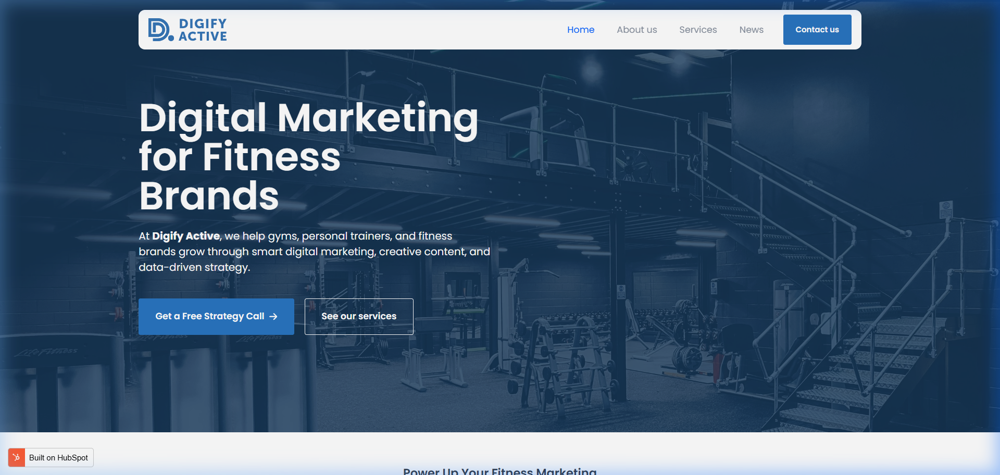

# Digify Active – B2B Marketing Agency Case Study

**[Live Project Site](https://digifyactive.com/) | [Project Analysis](./)**

## Project Overview
Digify Active is a team-based academic project focused on building and testing a specialized B2B marketing agency for the SME fitness industry. The scope of the project covers the entire go-to-market (GTM) lifecycle, from initial market research to the execution of performance marketing campaigns.

## Objectives
The primary objective was to simulate a realistic agency model that addresses the fragmented digital presence of small-to-medium fitness businesses through:
- **Strategic Differentiation:** Establishing a clear value proposition for gym owners.
- **Acquisition at Scale:** Implementing multi-channel paid acquisition with measurable ROI.
- **Conversion Optimization:** Designing a high-performance digital infrastructure (UX/UI and SEO).

## Strategic Approach
The project followed a structured consulting methodology to ensure data-driven decision making:

### 1. Market Research and Audit
- **Market Sizing:** Analyzing the SME fitness sector to identify high-potential segments.
- **Competitor Benchmarking:** Evaluating the digital maturity of existing local players.
- **Pain Point Identification:** Discovering core operational constraints (e.g., high churn, low lead quality).

### 2. Solution Design (UX/UI & Positioning)
- **Brand Identity:** Developing a trust-focused visual and verbal identity for the fitness industry.
- **Performance Web Design:** Building a responsive landing page optimized for lead capture.
- **Value Proposition:** Crafting a service model centered on "Powering Up Fitness Marketing."

### 3. Performance Marketing Execution
- **Paid Acquisition:** Designing and launching targeted Google Ads campaigns.
- **Funnel Tracking:** Implementing conversion tracking to monitor cost-per-lead (CPL) and click-through rates (CTR).
- **CRM Integration:** Streamlining lead management through HubSpot automation.

## Key Strategic Decisions
- **Content-First SEO:** Prioritizing high-intent keywords over broad traffic to ensure lead quality.
- **Agility in Spend:** Implementing a pilot-testing framework for ads to minimize waste before scaling.
- **Minimalist UX:** Focus on clear CTAs ("Get a Free Strategy Call") to maximize conversion speed.

## Project Outcomes
- **Validated GTM:** Successfully moved from theoretical concept to a functional, live agency model.
- **Insightful Analytics:** Demonstrated that intent-based search optimization significantly outperforms broad social media awareness for localized fitness leads.

---
### Links
- [View Live Digify Active Site](https://digifyactive.com/)
- [Main Portfolio Repository](https://github.com/elenadkrayneva/Elena-Krayneva-Data-Portfolio)
