# Oblicuo Hi-Fi Bar — Customer Insights & Weeknight Growth Strategy

  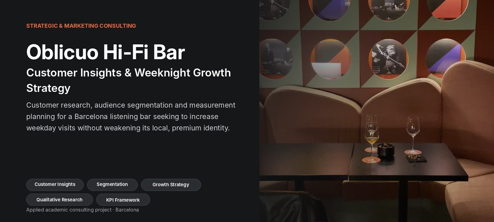

**Strategic & Marketing Consulting Project · Barcelona**

`Customer Insights` · `Qualitative Research` · `Audience Segmentation` · `Customer Journey` · `Growth Strategy` · `KPI Framework`

## Executive Summary

Oblicuo is a Barcelona listening bar inspired by Japanese Hi-Fi culture, combining curated music, craft cocktails and an intimate design-led environment.

The project addressed a strategic growth question:

> **How could Oblicuo increase Tuesday–Thursday visits while preserving its positioning as an authentic, premium and locally relevant venue?**

Our team combined platform and competitor analysis with primary customer research. We conducted 16 in-venue visitor interviews, developed a five-persona framework, mapped customer journeys and translated the findings into a locally focused growth strategy.

The recommendation prioritised relevant local demand rather than maximum reach. It connected customer barriers with audience-specific communication, an implementation plan and a KPI framework linking digital activity to offline visits.

  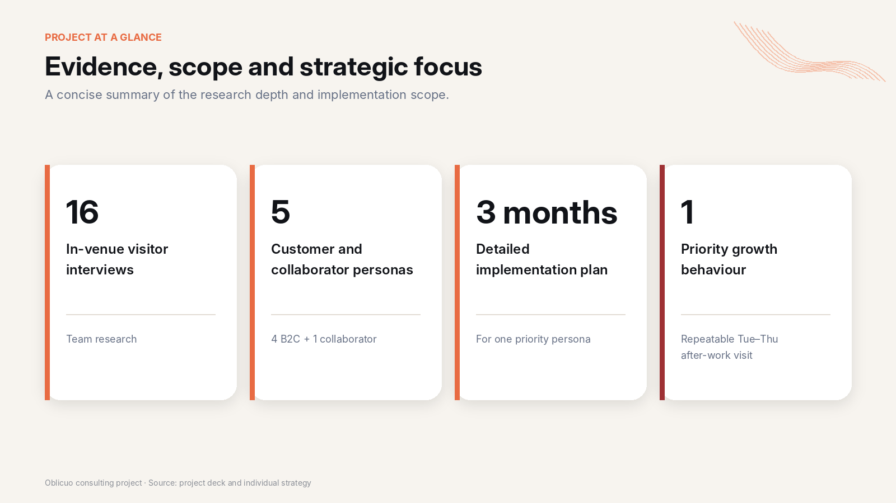

## Client Context

Oblicuo positions itself as more than a conventional cocktail bar. Its experience combines:

- high-fidelity sound and curated vinyl programming;
- craft cocktails, natural wines and artisanal sake;
- an intimate, design-led atmosphere;
- a connection with Barcelona’s local music and cultural scene.

At the time of the project, Instagram was the main owned platform, with more than 21,000 followers and a strong visual identity. However, the digital presence communicated what the venue looked like more clearly than whether it was the right choice for a specific occasion—especially an early-week visit.

## Business Challenge

Oblicuo had a recognisable identity and an established digital audience, but weekday demand remained a growth opportunity.

The challenge was not simply to maximise visibility. Broad viral reach could attract poorly aligned audiences, reinforce a tourist-oriented perception or weaken the intimate experience that differentiated the venue.

The strategic objective was therefore to generate more relevant local visits from Tuesday to Thursday while protecting Oblicuo’s premium, intimate and “hidden-gem” positioning.

  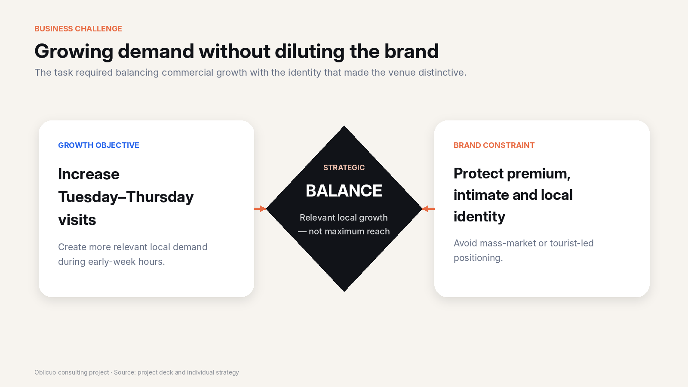

## Consulting Approach

We structured the project as a sequence of research, diagnosis and recommendation stages:

  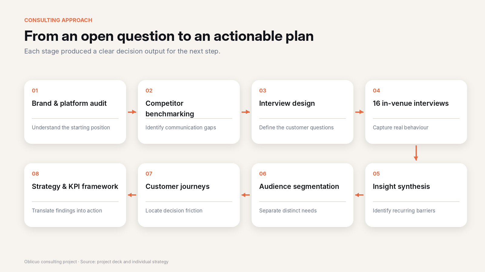

This process moved from an open commercial question to audience-specific and measurable recommendations.

## Primary Customer Research

The team conducted **16 interviews with individuals and small groups inside Oblicuo**.

The interview guide covered:

- discovery and visit motivation;
- expectations of a listening bar;
- perception of atmosphere;
- weekday and weekend behaviour;
- visit companions;
- social media usage;
- barriers to repeat visits;
- recommendation and sharing behaviour.

The purpose was to understand not only customer preferences, but how people made an actual venue-selection decision.

  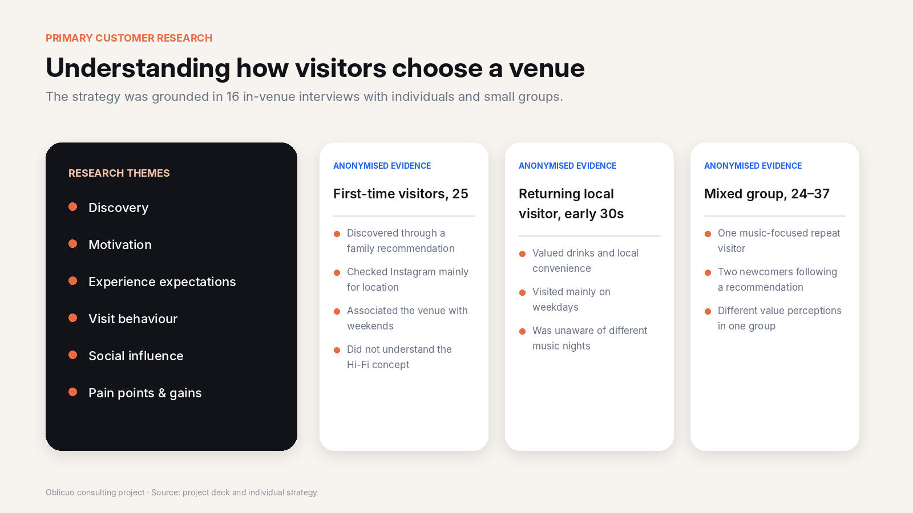

## Key Strategic Insights

  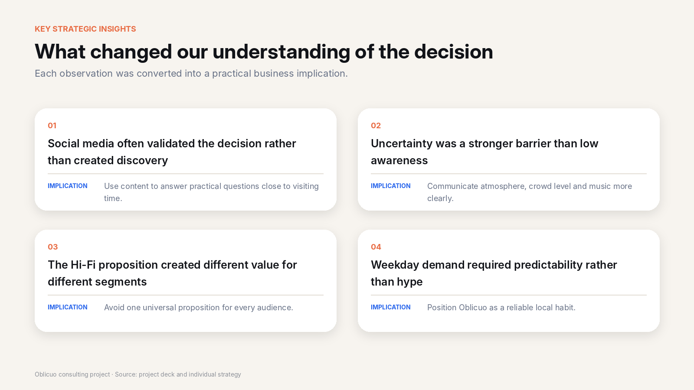

The research changed the strategy in four ways:

1. **Social media often validated a decision rather than generated initial discovery.**
2. **Uncertainty was a stronger barrier than low awareness.**
3. **The Hi-Fi proposition created different value for different segments.**
4. **Weekday demand required reliability rather than hype.**

## Audience Segmentation

Based on interview findings, we developed a five-persona framework representing different motivations and customer relationships with the venue.

### Customer personas

- **The After-Work Neighbor** — seeks proximity, calmness and consistency.
- **The Social First-Timer** — wants an accessible but distinctive social experience.
- **The Sound Lover** — prioritises music curation, authenticity and audio quality.
- **The Weekend Explorer** — seeks social energy without overcrowding or chaos.

### Collaborator persona

- **The Independent DJ** — contributes directly to the customer experience and the venue’s earned visibility.

  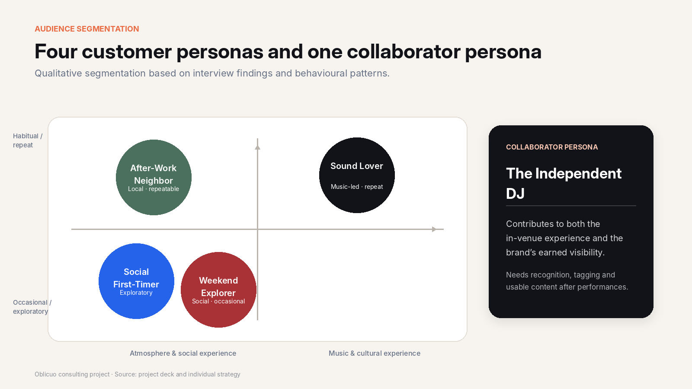

*The map is a qualitative synthesis of interview findings, not a quantitative clustering output.*

## Priority Growth Segment: The After-Work Neighbor

The After-Work Neighbor was especially relevant because the segment had the strongest behavioural fit with Tuesday–Thursday early-evening visits.

### Job to be done

> **Find a nearby place for one good drink and a comfortable conversation after work without planning a full night out.**

The main decision criteria were proximity, calmness, seating availability, conversation comfort and a predictable atmosphere. The main barriers were uncertainty about noise, crowd levels and whether the venue would feel too nightlife-oriented.

  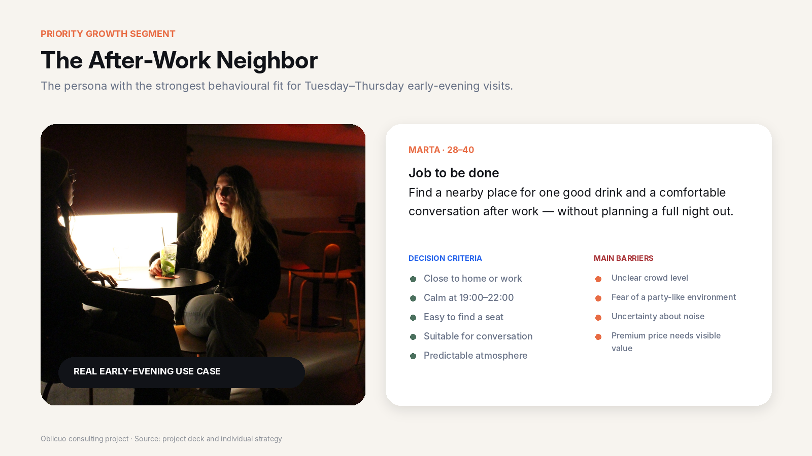

## Customer Journey

The priority persona was primarily located in the **consideration stage**. She already knew nearby options; the main challenge was deciding whether Oblicuo was suitable for that specific evening.

  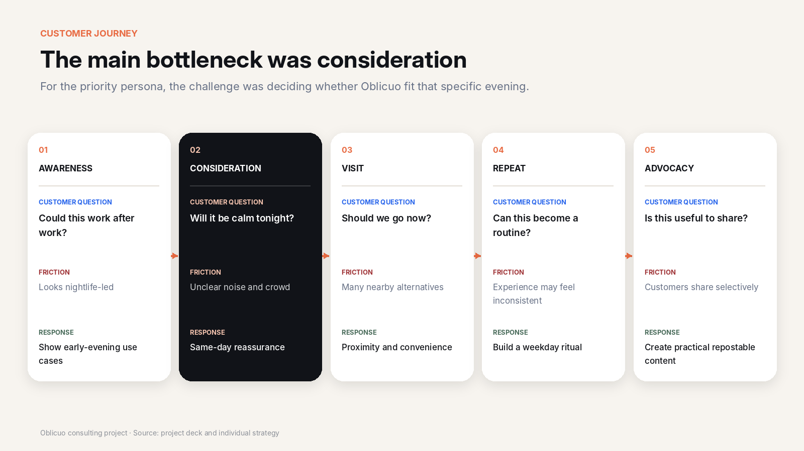

## Strategic Recommendation

The recommendation reframed social media from a general visibility channel into a tool for reducing customer uncertainty and supporting repeatable weekday behaviour.

  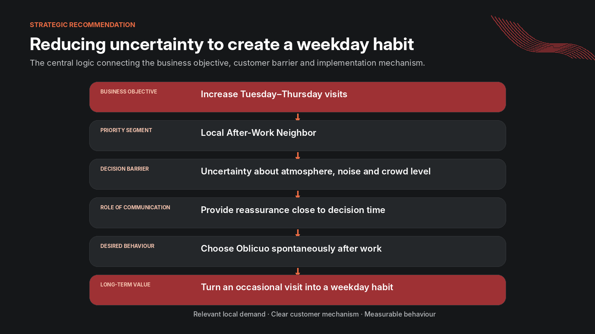

The strategy focused on:

- communicating the difference between early-evening and late-night atmosphere;
- showing available seating and conversation-friendly conditions;
- reinforcing proximity and convenience;
- presenting drinks and service as part of a reliable weekday ritual;
- avoiding hype, urgency and tourist-oriented messaging.

## From Strategy to Implementation

For the priority persona, the recommendation was translated into four content pillars:

1. **Calm and availability**
2. **After-work ritual**
3. **Familiar faces and craft**
4. **Local proximity**

  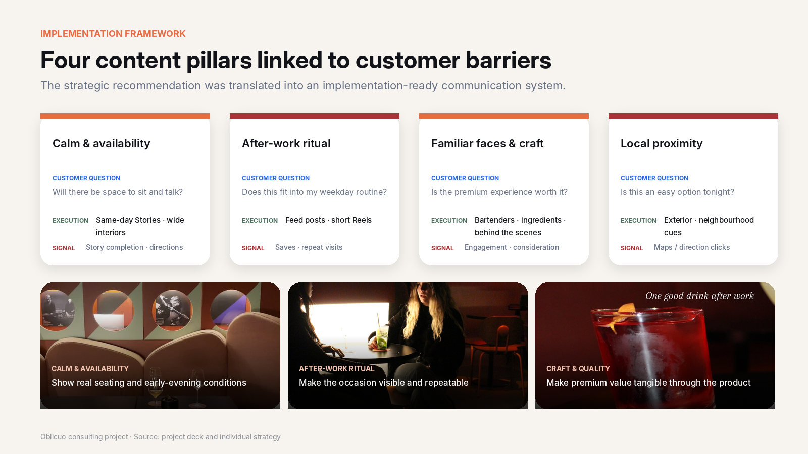

The recommended posting window was concentrated around **16:30–19:00**, close to the period when customers were likely to discuss or make an after-work decision.

  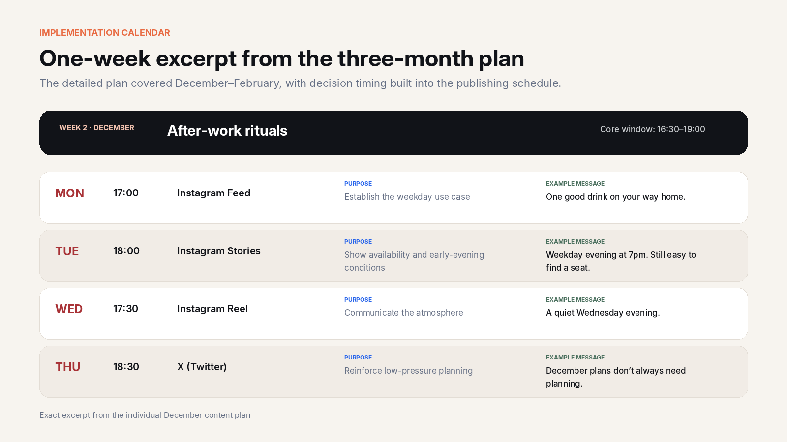

## Measurement Framework

The KPI framework connected social activity with the offline business objective.

  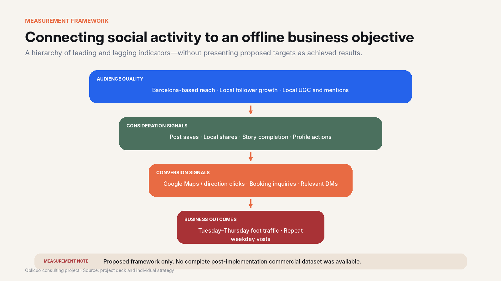

The framework distinguished:

- **Audience quality:** local reach, Barcelona-based followers and local UGC.
- **Consideration signals:** saves, shares, Story completion and profile actions.
- **Conversion signals:** directions clicks, booking inquiries and relevant DMs.
- **Business outcomes:** Tuesday–Thursday foot traffic and repeat weekday visits.

> **Measurement note:** these were proposed indicators and targets. The project did not include a complete post-implementation commercial dataset.

## Project Deliverables

- brand and platform audit;
- competitor benchmarking;
- customer interview guide;
- 16 in-venue visitor interviews;
- behavioural insight synthesis;
- five-persona framework;
- customer journey analysis;
- overall brand and platform strategy;
- creator and influencer recommendations;
- KPI and measurement framework;
- detailed strategy for one priority persona;
- three-month implementation plan;
- example content and visual concepts.

## My Contribution

I contributed across the main research and strategy stages of the consulting project, including:

- customer interviews and insight synthesis;
- competitor and platform analysis;
- development of the five-persona framework;
- customer journey analysis;
- overall brand and platform strategy;
- KPI and measurement framework;
- preparation of the final strategic recommendation and presentation.

For one priority persona—the **After-Work Neighbor**—I independently developed the detailed implementation layer, including the behavioural objective, journey-stage sub-goals, content principles, channel and timing logic, three-month content calendar, and proposed copy and visual concepts.

  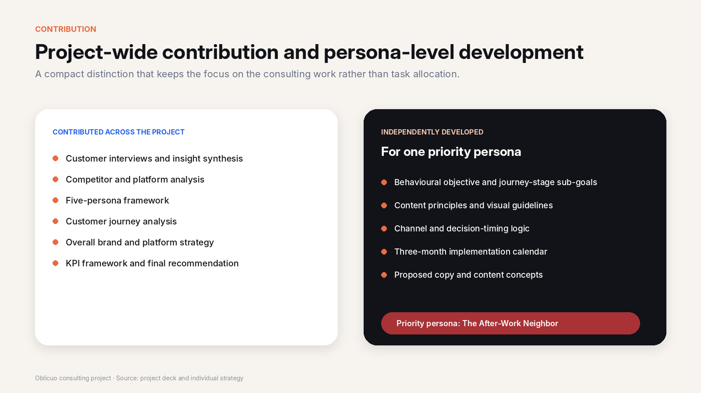

## Relevance to Strategic and Marketing Consulting

This project reflects several common consulting tasks:

### Problem structuring

- translated a broad growth objective into specific customer and channel questions;
- separated awareness problems from consideration and conversion barriers;
- balanced commercial growth with brand-positioning constraints.

### Customer and market analysis

- conducted primary qualitative research;
- identified behavioural patterns;
- developed customer segments and journeys;
- benchmarked competitor and platform strategies.

### Recommendation development

- prioritised a customer segment;
- connected customer barriers with practical initiatives;
- developed implementation and measurement frameworks;
- converted research findings into a clear strategic storyline.

### Executive communication

- synthesised customer and market information;
- developed presentation-ready conclusions;
- linked recommendations to the client’s business objective.

## Project Scope and Limitations

This was an applied academic consulting project focused on diagnosis, strategy and implementation planning.

The recommendations were not followed by a complete commercial implementation period, so the case does not claim measured growth in foot traffic, reservations or revenue.

The value of the project lies in the use of primary customer research, structured audience prioritisation, translation of insights into recommendations and development of an actionable KPI framework.
