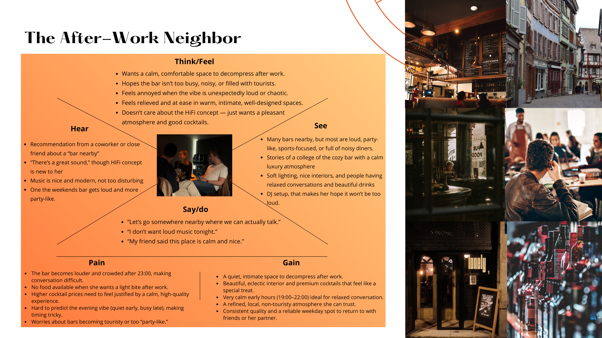
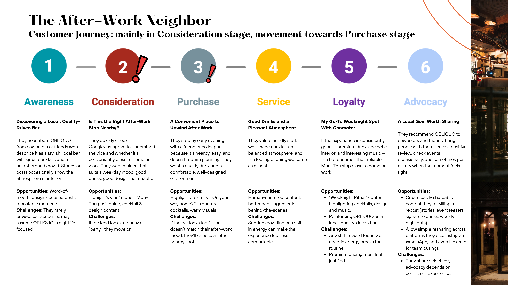

# Project 7: Oblicuo Hi-Fi Bar – Social Media Strategy & Customer Journey

## Project Overview
This project presents a data-informed social media content strategy for **Oblicuo Hi-Fi Bar** in Barcelona (a listening bar inspired by Japanese Hi-Fi culture, blending craft cocktails, natural wines, and high-fidelity audio). 

Based on primary research (16 depth interviews with visitors) and competitive auditing (Curtis Audiophile Café, Jaç Hi-Fi Café, Lonely Hi-Fi Café), the strategy addresses key customer friction points by shifting social media from an inspiration/discovery channel to a **predictable risk-reduction mechanism**.

---

## Key Frameworks & Deliverables

### 1. Customer Personas & Empathy Mapping
- **The After-Work Neighbor ("Marta", 28–40)**: Mid-level professional seeking a calm, cozy spot to decompress on Tuesday–Thursday (19:00–22:00). Risk-averse to noise, crowds, and tourist hype.
- **The Social First-Timer**: Curious about Hi-Fi culture but intimidated by niche audiophile rules; needs transparency on crowd size, ambiance, and social expectations.
- **The Sound Lover ("Alex", 25–35)** & **The Weekend Explorer ("Sofia", 25)**.

### 2. Customer Journey & Funnel Alignment
- **Awareness → Consideration**: Repositioning Oblicuo from late-night party space to predictable weekday evening venue.
- **Consideration → Purchase**: Publishing daily afternoon Stories (16:30–19:00 window) displaying seating availability, soft lighting, and calm body language to trigger spontaneous after-work visits.
- **Loyalty & Advocacy**: Establishing "Weekday Ritual" content themes, showcasing familiar bartenders and signature off-menu drinks.

### 3. Execution Roadmap & Content Calendar
- A complete 3-month multi-channel posting calendar (Instagram, Facebook, X, LinkedIn).
- Monthly themes: *"December doesn't have to be loud"*, *"January Back-to-Routine Reset"*, and *"Valentine's, but calm"*.

---

## Tech & Strategy Stack
- **Strategy & Analysis**: Social Listening, Competitive Auditing, Primary Qualitative Research (N=16 interviews)
- **Frameworks**: Customer Journey Mapping (CJM), Empathy Mapping, Funnel Optimization
- **Tools**: Instagram Insights, Excel Content Calendar Template, Adobe Creative Suite
