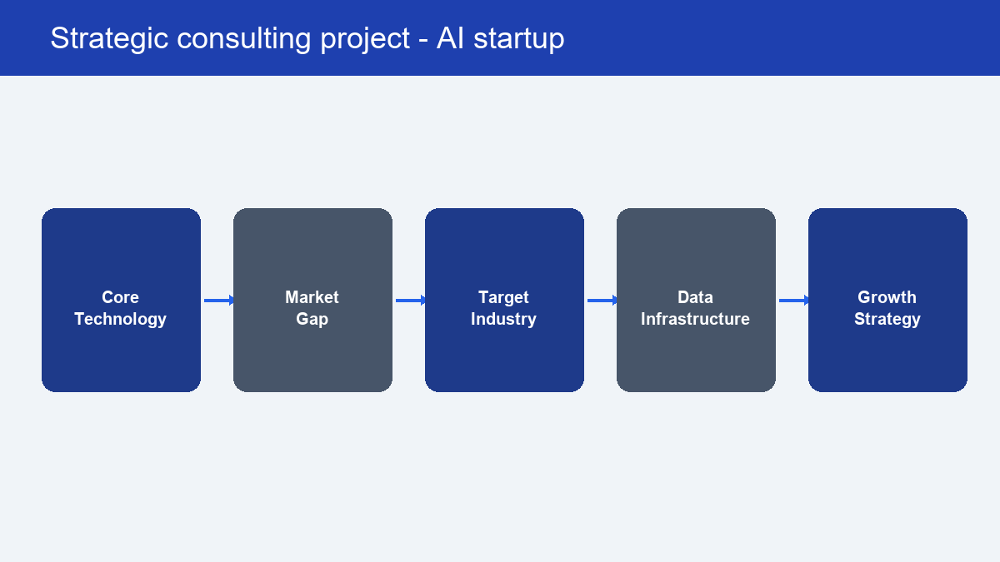

# Project 8: Zoria – Strategic Consulting for AI Startup

## Project Overview
Zoria is a strategic business consulting framework developed for an emerging **AI Startup**. The project bridges core AI technology capabilities with market expansion opportunities, defining data architecture, target industry positioning, and go-to-market growth models.

---

## Strategic Consulting Framework

### 1. Core Technology
- Evaluation of foundational AI models, proprietary NLP/LLM algorithms, and enterprise integration capability.

### 2. Market Gap Analysis
- Identifying unserved enterprise requirements in vertical automation, compliance-ready AI workflows, and domain-specific knowledge retrieval.

### 3. Target Industry Positioning
- Strategic selection of high-yield sectors (Marketing Analytics, B2B Operations, Digital Health/Services) based on market willingness to pay and operational bottlenecks.

### 4. Data Infrastructure Strategy
- Structuring secure data pipelines, user feedback loops, data governance frameworks, and scalability protocols.

### 5. Growth & Go-to-Market Strategy
- Defining B2B customer acquisition funnels, unit economics (LTV/CAC), pricing models, and strategic partnership channels.

---

## Tech & Strategy Stack
- **Business Strategy**: Go-to-Market (GTM) Strategy, Value Proposition Canvas, Market Gap Analysis
- **AI Infrastructure**: LLM Pipeline Architecture, Data Governance, Enterprise Integration Strategy
- **Tools**: Financial Modeling, Market Sizing (TAM/SAM/SOM), Data Flow Diagrams
