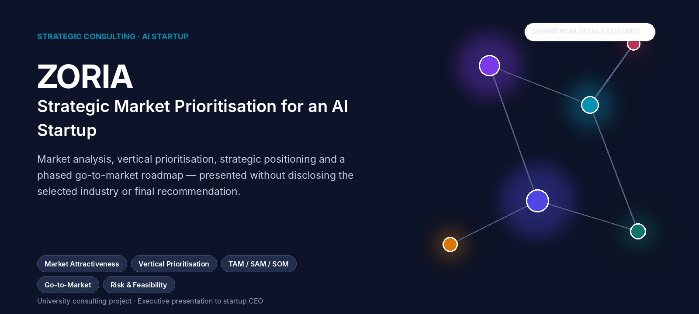
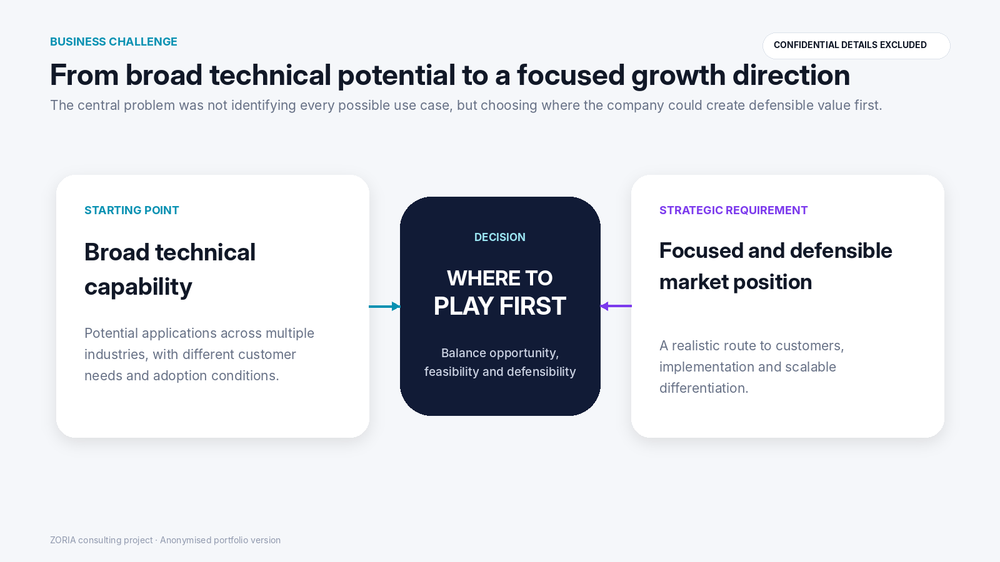
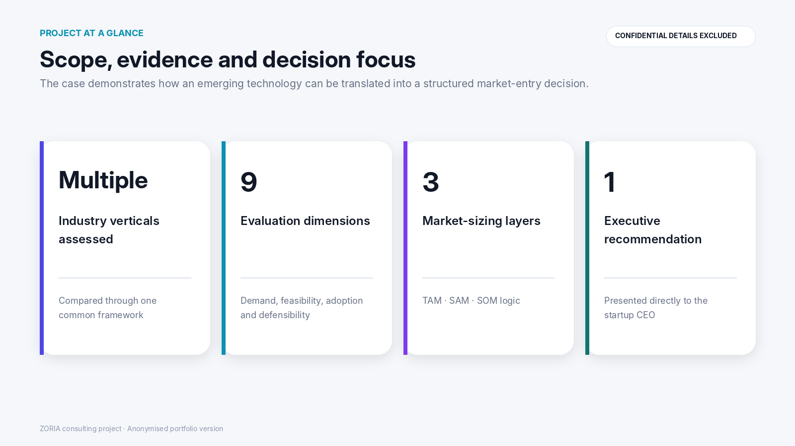
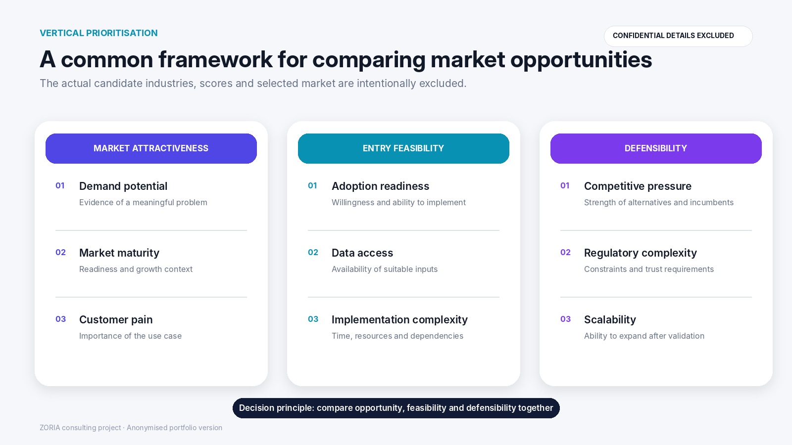
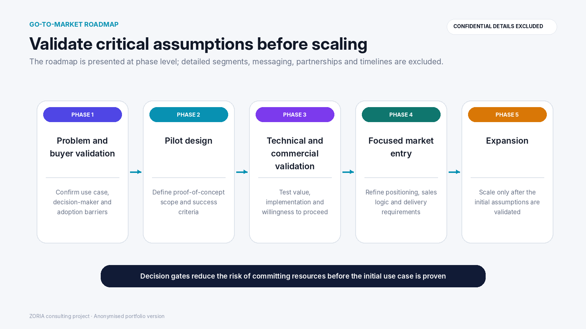
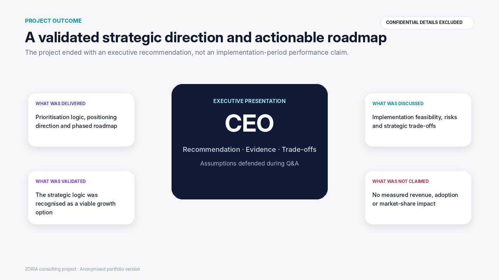
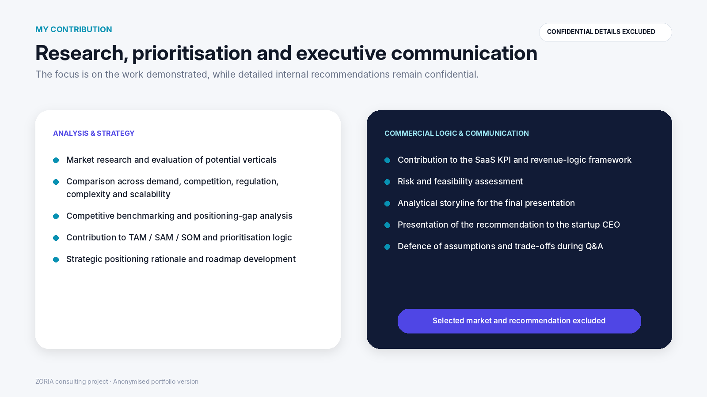

# ZORIA — Strategic Market Prioritisation for an AI Startup

  

**University Strategic Consulting Project**

`Market Research` · `Vertical Prioritisation` · `Competitive Benchmarking` · `TAM / SAM / SOM` · `Go-to-Market`

> **Confidentiality:** the selected industry, detailed customer segments, market values, proprietary positioning and final recommendation are intentionally excluded.

## The Challenge

ZORIA is an early-stage technology startup specialising in automated image processing and synthetic dataset generation.

The company had broad technical potential but lacked a focused market position. The central question was:

> **Which market vertical should the company prioritise to achieve scalable growth and stronger differentiation?**

  

## What We Did

The team:

- researched multiple potential applications;
- benchmarked competitors and adjacent solutions;
- compared industries through one decision framework;
- contributed to TAM / SAM / SOM logic;
- developed a positioning direction and phased roadmap;
- assessed implementation risks and KPI logic;
- presented the recommendation to the startup CEO.

  

## Prioritisation Framework

Potential markets were compared across nine dimensions covering:

- **market attractiveness** — demand, maturity and customer pain;
- **entry feasibility** — adoption readiness, data access and implementation complexity;
- **defensibility** — competition, regulation and scalability.

  

The actual industries, scores and selected market are not included in this public version.

## Recommendation Logic

The recommendation connected:

1. a defined customer problem;
2. a clear role for the technology;
3. measurable business value;
4. adoption and implementation requirements;
5. a defensible source of differentiation.

The strategy was translated into a phased roadmap: customer validation, pilot design, technical and commercial validation, focused market entry and expansion.

  

## Outcome

The final analysis and recommendation were presented directly to the CEO. The team defended the evidence, trade-offs, assumptions and implementation risks during Q&A.

  

The project delivered a validated strategic direction and actionable roadmap—not measured post-launch commercial results.

## My Contribution

My work included:

- market and vertical research;
- competitor benchmarking;
- comparison of demand, regulation, complexity and scalability;
- contribution to prioritisation and TAM / SAM / SOM logic;
- positioning-gap analysis;
- roadmap and KPI development;
- structuring the final analytical storyline;
- presenting and defending the recommendation to the CEO.

  

## Skills Demonstrated

**Market analysis · Strategic prioritisation · Competitive benchmarking · Market sizing · Go-to-market planning · Risk assessment · Executive communication**
